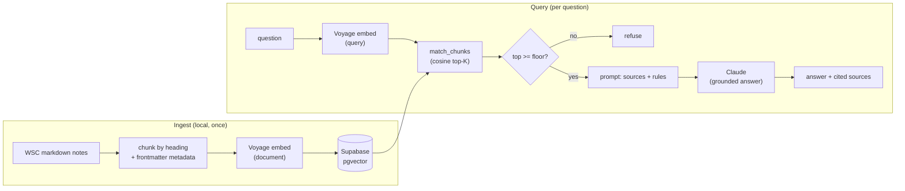

# Guiding Questions Assistant

A retrieval-augmented Q&A app over the **World Scholar's Cup 2026 syllabus** (the *Guiding
Questions*). A coach fact-checking mid-session or a student revising can ask a question and get a
short answer **tied to the exact section it came from** — and when the syllabus doesn't cover
something, the app **says so instead of inventing an answer**.

That refusal is the point. The competition's facts get taught to students and used in a hall; a
plausible-but-wrong answer is worse than no answer. So this is a RAG that is built to **refuse to
hallucinate** rather than to sound confident.

> **Live demo:** _(add the Vercel URL here after deploy)_
> **Attribution:** syllabus source of record — <https://themes.scholarscup.org/#/themes/2026/guidingquestions>

---

## What it does

- **Grounded answers with citations.** Every answer cites the syllabus sections it used, linked back
  to the source of record.
- **Retrieve-or-refuse.** Two independent guardrails: a similarity **floor** (a cheap pre-filter)
  and a **grounding instruction** to the model ("use only these sources; refuse otherwise"). The
  model-side check is the primary guard.
- **Honest about the unknown.** For facts the syllabus genuinely doesn't publish (exact Challenge
  question counts, Collaborative Writing phase timings), it says they're unpublished and points to
  the round-specific materials — it does not fabricate a number.
- **Subject filter.** Scope a lookup to one of the six subject areas.

## Architecture



**Stack:** Next.js (App Router) + TypeScript on Vercel · Supabase Postgres + `pgvector` · Voyage AI
embeddings (`voyage-3.5-lite`, asymmetric query/document) · Anthropic Claude generation. One chat
page, one server action. See [DECISIONS.md](./DECISIONS.md) for the reasoning.

## Eval

A small but real grading harness ([`eval/golden.json`](./eval/golden.json),
[`scripts/eval.ts`](./scripts/eval.ts)), built from the corpus itself:

- **Must-answer** (named-works facts) — the expected source must be retrieved, answered, and cited.
- **Must-refuse** (off-topic) — must refuse.
- **No-invent** (the syllabus's own unpublished "open questions") — must acknowledge it's
  unpublished without fabricating a figure.

**Latest score: 16/16** — retrieval recall 12/12, answered + cited 12/12, refusals 2/2,
unpublished-without-inventing 2/2. Re-run after any change to chunking, the floor, or the prompt:

```bash
npm run eval
```

## Run it locally

```bash
npm install
cp .env.example .env.local   # then fill in the values (see below)
npm run check-db             # verify Supabase + schema
npm run ingest               # ingest the synthetic sample corpus
npm run query -- "Who painted Rain, Steam, and Speed?"
npm run dev                  # http://localhost:3000
```

**Environment** (`.env.local`): a Supabase project (URL + keys), `VOYAGE_API_KEY`,
`ANTHROPIC_API_KEY`. See [`.env.example`](./.env.example). Apply [`sql/schema.sql`](./sql/schema.sql)
in the Supabase SQL editor first.

The public repo ships only a tiny **synthetic** sample corpus. The real WSC notes are copyright-
sensitive and never committed; point `INGEST_SOURCE_DIR` at a local knowledge base and run
`npm run ingest:wsc` to index them.

## Project layout

```
app/            one chat page + server action (rate-limited, input-capped)
lib/            config, Voyage client, chunker, retrieval + generation pipeline
scripts/        ingest, query, eval, db + corpus checks (run with tsx)
sql/schema.sql  chunks table, ivfflat index, match_chunks RPC
eval/           golden set
content/sample/ synthetic fixtures (the real corpus is gitignored)
```
