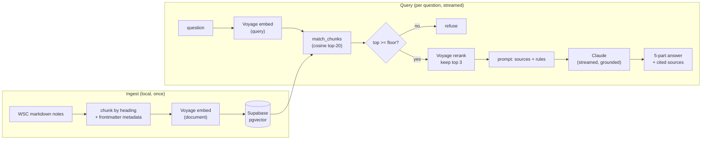

# Guiding Questions Assistant

A retrieval-augmented Q&A app over the **World Scholar's Cup 2026 syllabus** (the *Guiding
Questions*). A coach fact-checking mid-session or a student revising can ask a question and get a
short, structured answer **tied to the exact sections it came from** — and when the syllabus
doesn't cover something, the app **says so instead of inventing an answer**.

That refusal is the point. The competition's facts get taught to students and used in a hall; a
plausible-but-wrong answer is worse than no answer. So this is a RAG built to **refuse to
hallucinate** rather than to sound confident — and to *prove* it does, with an eval harness.

> **Live demo:** <https://wsc-syllabus-rag.vercel.app>
> **Syllabus source of record:** <https://themes.scholarscup.org/#/themes/2026/guidingquestions>

---

## What it does

- **Grounded, structured answers.** Every grounded answer comes back in five labelled sections —
  *Short answer → Detailed explanation → Further background → Connections across the syllabus →
  Key idea to remember* — and streams in token by token. Background and connections are drawn
  **only** from the retrieved sources, and every claim carries a `[n]` citation to the section it
  came from.
- **Retrieve-or-refuse.** Two independent guardrails: a similarity **floor** (a cheap pre-filter)
  and a **grounding instruction** to the model ("use only these sources; refuse otherwise"). The
  model-side check is the primary guard.
- **Honest about the unknown.** For facts the syllabus genuinely doesn't publish (exact Challenge
  question counts, Collaborative Writing phase timings), it says they're unpublished and points to
  the round-specific materials — it does not fabricate a number.
- **Cross-syllabus connections.** The *Connections* section names the other 2026 sections a topic
  links to and the specific idea that ties them — mirroring how the competition rewards seeing
  links across subjects.

## Architecture



**Stack:** Next.js 16 (App Router) + TypeScript on Vercel · Supabase Postgres + `pgvector` · Voyage
AI **embeddings** (`voyage-3.5-lite`, asymmetric query/document) and **reranker** (`rerank-2.5-lite`)
· Anthropic Claude generation, streamed over a route handler. One chat page. See
[DECISIONS.md](./DECISIONS.md) for the reasoning behind each choice.

## Two-stage retrieval

Retrieval is a wide-then-narrow pipeline: **vector search** pulls the top 20 candidates by cosine
similarity, then a **cross-encoder reranker** scores the question against each candidate together
and keeps the 3 most relevant to send to the model. The bi-encoder is a fast, rough first pass; the
reranker is the careful judge. On this corpus that promotes the fullest, most-relevant passages over
short fragments — improving ranking *and* cutting the tokens sent to the model (see below).

## Evaluation

Quality is measured, not asserted. A 58-case golden set ([`eval/golden.json`](./eval/golden.json))
built from the corpus itself drives two harnesses:

- **Retrieval + answering** ([`scripts/eval.ts`](./scripts/eval.ts)) — recall@k, MRR and nDCG on the
  retrieved sources, plus whether the app answered-and-cited, refused off-topic questions, and
  declined to invent unpublished facts. Includes a **hard subset** that describes a work *without
  naming it*, where retrieval is stressed most.
- **Faithfulness** ([`scripts/eval-faithfulness.ts`](./scripts/eval-faithfulness.ts)) — an
  LLM-as-judge breaks each answer into claims and checks every one against *only* its retrieved
  sources, catching any fact the model added from outside knowledge.

```bash
npm run eval                # retrieval + answering metrics
npm run eval:faithfulness   # LLM-as-judge grounding check
```

### Results

Bi-encoder retrieval was already at ceiling on this 683-chunk corpus, so the reranker was added as a
**precision + cost** improvement, not a recall one — and the eval is what let me tell the difference
and prove it.

| Metric | Baseline (top-6, vector only) | + Reranker (top-3) |
|---|---:|---:|
| Recall@1 | 95.5% | **97.7%** |
| Recall@3 | 100% | 100% |
| MRR | 0.977 | **0.989** |
| nDCG@5 | 0.983 | **0.992** |
| Answered + cited | 44/44 | 44/44 |
| Correct refusals | 10/10 | 10/10 |
| Faithfulness (claim support) | 98.6% | 98.2% |
| Avg prompt tokens / answer | 3,851 | **2,365 (−39%)** |
| Avg cost / answer | $0.00564 | **$0.00410 (−27%)** |

Same answer quality, better ranking, **~27% cheaper per answer.** On the *hard* subset (describe a
work without naming it), retrieval holds at 100% Recall@1.

## Run it locally

```bash
npm install
cp .env.example .env.local   # then fill in the values (see below)
npm run check-db             # verify Supabase + schema
npm run ingest               # ingest the synthetic sample corpus
npm run query -- "Who painted Rain, Steam, and Speed?"
npm run dev                  # http://localhost:3000
```

**Environment** (`.env.local`): a Supabase project (URL + keys), `VOYAGE_API_KEY`,
`ANTHROPIC_API_KEY`. See [`.env.example`](./.env.example). Apply [`sql/schema.sql`](./sql/schema.sql)
in the Supabase SQL editor first.

The public repo ships only a tiny **synthetic** sample corpus. The real WSC notes are copyright-
sensitive and never committed; point `INGEST_SOURCE_DIR` at a local knowledge base and run
`npm run ingest:wsc` to index them.

## Project layout

```
app/
  page.tsx        one chat page; reads the streamed NDJSON answer
  api/ask/route.ts  streaming query endpoint (rate-limited, input-capped)
lib/
  rag.ts          retrieve -> rerank -> floor -> generate pipeline
  rerank.ts       Voyage cross-encoder reranker
  voyage.ts       embeddings client (asymmetric query/document)
  anthropic.ts    generation (streaming + non-streaming)
  chunk.ts        heading-based chunker with metadata
  guards.ts       per-IP rate limit + daily spend cap
sql/schema.sql    chunks table, ivfflat index, match_chunks RPC
scripts/          ingest, query, eval, eval-faithfulness, db + corpus checks
eval/golden.json  58-case golden set
content/sample/   synthetic fixtures (the real corpus is gitignored)
```
